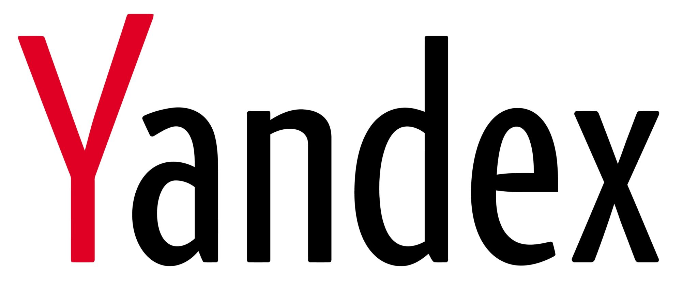

### Привет! Меня зовут Алексей и здесь я собираюсь воплощать мечту в реальность!

- 🧂 Работаю в компании Salt & Pepper на позиции frontend developer.
- 🌶️ Занимаю позицию ментора стажеров в компании Salt & Pepper.
- 🚀 Закончил обучение в Яндекс.Практикум на направлении Web-разработчик.
- 👴🏼 Стал старшим студентом в Яндекс.Практикум и помогаю новичкам в освоении профессии.
- 🌱 Постоянно развиваюсь и ищу источники новых знаний. 

## 🧠 Технологический стек:
             
&nbsp;

## 📍Мои контакты:
 

## 🥷🏼 В соревновании рождается сила:

## 🧾 Обо мне языком цифр:

